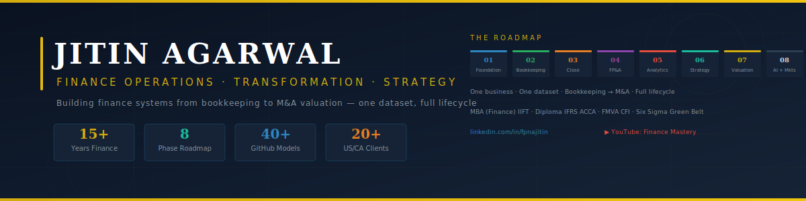

<!-- BANNER -->
<p align="center">
  
</p>

<!-- TYPING ANIMATION -->
<p align="center">
  <a href="https://git.io/typing-svg">
    
  </a>
</p>

<!-- SOCIAL BADGES -->
<p align="center">
  <a href="https://linkedin.com/in/fpnajitin"></a>&nbsp;
  <a href="#"></a>&nbsp;
  <a href="mailto:Jitin.iift@gmail.com"></a>&nbsp;
  <a href="#"></a>
</p>

<p align="center">
  
</p>

---

## 🏛️ About Me

```
┌──────────────────────────────────────────────────────────────────────────────┐
│                                                                              │
│   Jitin Agarwal                                                              │
│   Finance Operations Senior Manager · Transformation Architect               │
│                                                                              │
│   15+ years building, scaling, and transforming finance operations            │
│   for US/Canada CPA firms. 25-member teams. 20+ clients. Zero SLA            │
│   breaches across 8 consecutive quarters.                                    │
│                                                                              │
│   Now documenting the entire finance lifecycle — from first journal           │
│   entry to M&A valuation — as open-source models on GitHub.                  │
│                                                                              │
│   📍 Faridabad, India                                                        │
│   🎓 MBA (Finance) IIFT · Diploma IFRS ACCA · FMVA CFI USA                  │
│   🏅 Lean Six Sigma Green Belt · SAP GBI · Xero · QBO Certified             │
│                                                                              │
└──────────────────────────────────────────────────────────────────────────────┘
```

<table>
<tr>
<td width="50%">

### 🎯 For Recruiters & Employers
- **Current:** Sr. Finance Ops Manager — Magone CPAs via Arabella Consulting
- **Expertise:** End-to-end accounting finalization, multi-entity close, US GAAP (ASC 630/810/842)
- **Scale:** 25 FTEs managed, 20+ US/CA CPA firm clients, 70% manual effort reduction
- **Target roles:** Finance Ops Director · CFO · Transformation Consultant

</td>
<td width="50%">

### 🎥 For Students & Professionals
- **Building:** Finance Mastery — a complete YouTube + GitHub series
- **Teaching:** One business, one dataset, bookkeeping → M&A valuation
- **Academy:** Engine 2 Capability Factory — training India's US-CPA-ready talent
- **Free resources:** 40+ Excel models, templates, and frameworks below ↓

</td>
</tr>
</table>

---

## 🗺️ The Finance Mastery Roadmap

> **One business. One dataset. Eight phases. Bookkeeping to M&A valuation.**
>
> Every model in this repo uses **Clearline Supply Co.** — a fictional $2.4M B2B distributor modelled on 20+ real CPA clients. The P&L built in Phase 3 becomes the DCF input in Phase 7. Same numbers. Full circle.

<table>
<tr>
<td align="center" width="12.5%">
<br/>
<sub><b>Weeks 1–8</b></sub><br/>
<sub>Business + QBO<br/>Setup + COA</sub>
</td>
<td align="center" width="12.5%">
<br/>
<sub><b>Weeks 9–18</b></sub><br/>
<sub>Full Cycle<br/>AP/AR + Recon</sub>
</td>
<td align="center" width="12.5%">
<br/>
<sub><b>Weeks 19–32</b></sub><br/>
<sub>Finalization<br/>Report Delivery</sub>
</td>
<td align="center" width="12.5%">
<br/>
<sub><b>Weeks 33–44</b></sub><br/>
<sub>Budget + Forecast<br/>Variance</sub>
</td>
<td align="center" width="12.5%">
<br/>
<sub><b>Weeks 45–54</b></sub><br/>
<sub>KPIs + Ratios<br/>Benchmarks</sub>
</td>
<td align="center" width="12.5%">
<br/>
<sub><b>Weeks 55–66</b></sub><br/>
<sub>BCG + Porter<br/>Value Chain</sub>
</td>
<td align="center" width="12.5%">
<br/>
<sub><b>Weeks 67–76</b></sub><br/>
<sub>DCF + Deal<br/>Structure</sub>
</td>
<td align="center" width="12.5%">
<br/>
<sub><b>Weeks 77–80</b></sub><br/>
<sub>Automation<br/>Capstone</sub>
</td>
</tr>
</table>

---

## 📂 Project Repository Map

> Click any folder to explore models, templates, and case studies.

<table>
<tr>
<td width="25%">

#### 📁 [`/01-foundation`](#)

- `Business_Brief.pdf`
- `COA_Template.xlsx`
- `QBO_Setup_Checklist.xlsx`
- `Seasonality_Curve.xlsx`
- `Opening_Balance_JE.xlsx`
- `Integration_Stack_Diagram.pdf`

</td>
<td width="25%">

#### 📁 [`/02-bookkeeping`](#)

- `AP_AR_Tracker.xlsx`
- `Bank_Recon_Workbook.xlsx`
- `Payroll_JE_Template.xlsx`
- `Transaction_Dataset_Full.xlsx`
- `Month_End_Checklist.xlsx`
- `1099_Prep_Guide.pdf`

</td>
<td width="25%">

#### 📁 [`/03-close-reports`](#)

- `Close_Checklist.xlsx`
- `Intercompany_Recon.xlsx`
- `Lease_Amortization.xlsx`
- `3_Statement_Model.xlsx`
- `Monthly_Report_Package.xlsx`
- `Executive_Summary.docx`
- `Benchmark_Comparison.xlsx`

</td>
<td width="25%">

#### 📁 [`/04-fpa`](#)

- `Driver_Budget_Model.xlsx`
- `Rolling_Forecast.xlsx`
- `Variance_Analysis_Pack.xlsx`
- `Scenario_Model.xlsx`
- `KPI_Dashboard.pbix`

</td>
</tr>
<tr>
<td width="25%">

#### 📁 [`/05-analytics`](#)

- `KPI_Master_Tracker.xlsx`
- `Ratio_Analysis_Workbook.xlsx`
- `Sensitivity_Table.xlsx`
- `5yr_Trend_Analysis.xlsx`
- `Industry_Benchmark.xlsx`

</td>
<td width="25%">

#### 📁 [`/06-strategy`](#)

- `BCG_Analysis.xlsx`
- `Porter_Framework.pptx`
- `Integration_Impact_Model.xlsx`
- `Value_Chain_Map.xlsx`
- `Make_vs_Buy_Model.xlsx`

</td>
<td width="25%">

#### 📁 [`/07-valuation`](#)

- `DCF_Model.xlsx`
- `WACC_Calculator.xlsx`
- `Comps_Analysis.xlsx`
- `Football_Chart.xlsx`
- `MA_Deal_Model.xlsx`
- `Accretion_Dilution.xlsx`

</td>
<td width="25%">

#### 📁 [`/08-markets`](#)

- `Stock_Analysis.xlsx`
- `10K_Review_Checklist.xlsx`
- `Capital_Allocation.xlsx`
- `Beta_Calculator.xlsx`

</td>
</tr>
</table>

---

## 🛠️ Tech Stack

<table>
<tr>
<td align="center" width="20%"><b>Cloud ERPs</b></td>
<td align="center" width="20%"><b>Data & Analytics</b></td>
<td align="center" width="20%"><b>AI & Review</b></td>
<td align="center" width="20%"><b>Automation</b></td>
<td align="center" width="20%"><b>Integrations</b></td>
</tr>
<tr>
<td align="center">


</td>
<td align="center">


</td>
<td align="center">


</td>
<td align="center">


</td>
<td align="center">


</td>
</tr>
</table>

---

## 📊 KPI & Analytics Framework

> The complete financial performance framework I use — 8 layers, applied to real business data.

```
┌─────────────────────────────────────────────────────────────────────┐
│  LAYER 1 ▸ PROFITABILITY    GP% · EBITDA% · NP% · Break-even      │
│  LAYER 2 ▸ RETURNS          ROI · ROE · ROCE · ROIC · EVA         │
│  LAYER 3 ▸ LIQUIDITY        Current · Quick · CCC · AR/AP Days    │
│  LAYER 4 ▸ SOLVENCY         D/E · ICR · DSCR · Altman Z-Score    │
│  LAYER 5 ▸ EFFICIENCY       Asset TO · Inventory TO · Recv. TO    │
│  LAYER 6 ▸ COST CONTROL     COGS% · OpEx Ratio · Fixed/Variable  │
│  LAYER 7 ▸ UNIT ECONOMICS   LTV/CAC · Payback · Contribution/Unit│
│  LAYER 8 ▸ STRATEGIC VALUE  WACC · Beta · MVA · BCG + Value Chain │
└─────────────────────────────────────────────────────────────────────┘
```

---

## 🧩 Strategy Frameworks Applied

> Every framework is applied to the same business case with financial proof — not just theory.

| Framework | Financial Impact | Decision It Drives |
|:--|:--|:--|
| **Porter's 5 Forces** | Pricing power → EBITDA margin | Invest / Exit |
| **BCG Matrix** | Revenue growth → Cash flow allocation | Allocate / Divest |
| **Value Chain** | Cost structure → Margin optimization | Cut / Optimize |
| **SWOT + VRIO** | Competitive moat → Premium pricing | Protect / Build |
| **Ansoff Matrix** | Growth investment → CAPEX decisions | Expand / Diversify |
| **DCF Valuation** | Intrinsic value → Deal pricing | Acquire / Pass |
| **M&A Synergy** | Cost + Revenue synergies → ROIC | Merge / Walk Away |
| **Scenario Analysis** | Risk-adjusted returns → Strategy shift | Hedge / Proceed |

---

## 📈 GitHub Stats

<p align="center">
  
  
</p>

<p align="center">
  
</p>

---

## 🏆 Career Snapshot

```
 2024–Present  ║  Sr. Finance Ops Manager — Magone CPAs via Arabella Consulting
               ║  → 25 FTEs · 20+ US/CA clients · Zero SLA breaches (8 quarters)
               ║  → Built firm-wide Scale-Readiness Framework
               ║  → 70% manual effort reduction via workflow automation
               ║
 2022–2023     ║  Manager, Finance Operations — Global FPO
               ║  → Led 25-member multi-country team (AP/AR/R2R)
               ║  → 100% team retention · Zero backlog for 8 quarters
               ║  → Migrated legacy tools → cloud ERPs (zero downtime)
               ║
 2021          ║  FINOPS Analyst — Whiz Consulting (Australia + USA)
               ║  → Automated IFRS-16 compliance templates
               ║  → 70% manual effort reduction
               ║
 2018–2021     ║  FINOPS Consultant — Vinlas Consulting
               ║  → FP&A for e-commerce · 15% revenue forecast improvement
               ║
 2010–2018     ║  Senior Accountant → FINOPS Lead
               ║  → Built foundation across manufacturing, media, import/export
```

---

## 📜 Certifications

<p align="center">
  
  
  
  
</p>
<p align="center">
  
  
  
  
  
  
</p>

---

## 🎯 What I'm Building Right Now

| Project | Status | Description |
|:--|:--|:--|
| **Finance Mastery YouTube** | 🔨 Building | 52+ video series: bookkeeping → M&A valuation |
| **Clearline Supply Co.** | 🔨 Building | End-to-end business case — every model on GitHub |
| **Engine 2 Academy** | ✅ Active | Training India's US-CPA-ready talent (4 tiers) |
| **KPI Framework** | ✅ Complete | 8-layer ratio analysis workbook |
| **Strategy Frameworks Guide** | ✅ Complete | 30+ frameworks with financial linkage |

---

## 🤝 Let's Connect

<p align="center">

**For hiring / consulting:** [Jitin.iift@gmail.com](mailto:Jitin.iift@gmail.com) · [LinkedIn](https://linkedin.com/in/fpnajitin)

**For learning / collaboration:** Subscribe to [Finance Mastery on YouTube](#) · Star this repo ⭐

</p>

---

<p align="center">
  
</p>

<p align="center">
  <sub>
    <b>Built with clarity, not complexity.</b><br/>
    Every model here is battle-tested on real US/Canada CPA firm engagements.<br/>
    Star ⭐ the repo if it helps you. Fork 🍴 it if you want to build on it.<br/><br/>
    <i>"The channel isn't a side project. It's your finance career — documented, structured, and shareable."</i>
  </sub>
</p>
